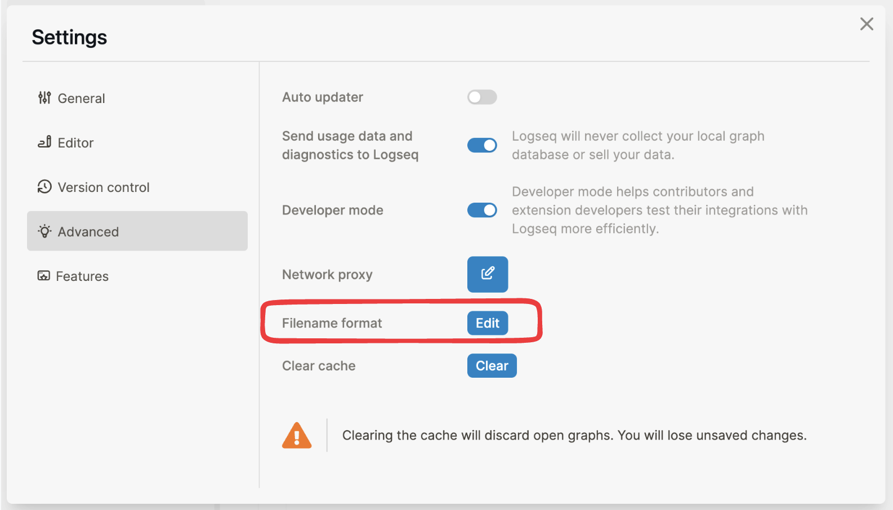
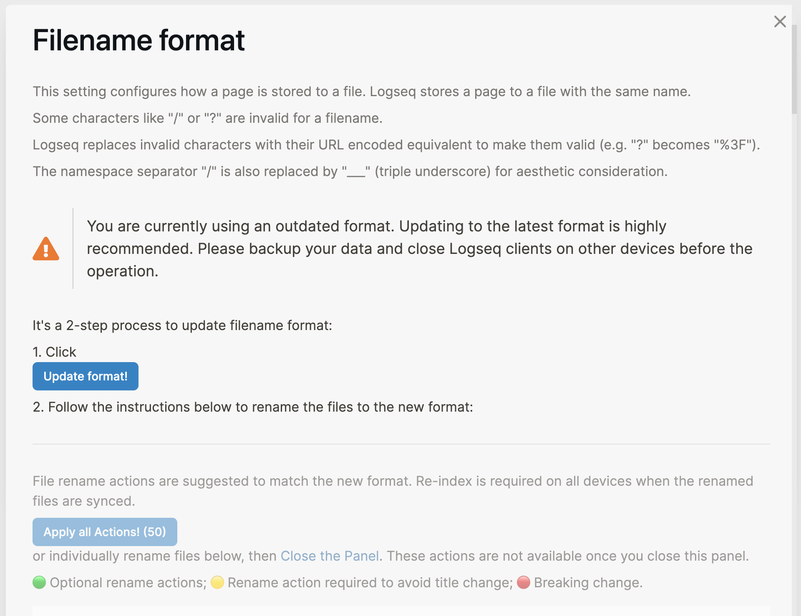
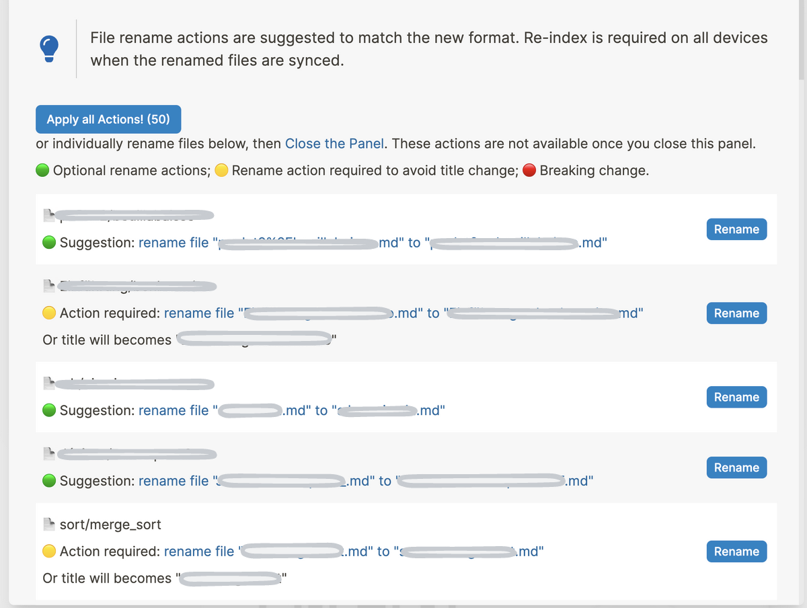

type:: [[Feature]]
platform:: [[Desktop]]
description:: Allow users to migrate the filenames to the latest format
initial-version:: 0.8.9

- #+BEGIN_IMPORTANT
  Make sure all Logseq clients on your devices are upgraded to `0.8.9` or above when you are going to apply the new filename format (`:triple-lowbar`).
  Newly created graphs on Logseq `0.8.9` or above are also using the new filename format by default. May restore the legacy format to keep compatible with old Logseq versions.
  #+END_IMPORTANT
- ## Usage
	- You may find the `Filename format` setting since Logseq `0.8.9`
		- 
	- This setting configures how a page **in the current graph** is stored to a file
		- Only upgrade to the latest format is available.
	- To change the config, click the `Edit` button and follow the instructions in the pop-up `Filename format` panel to convert your files.
		- #+BEGIN_WARNING
		  **Backup** all your notes somewhere else **first** before continue
		  #+END_WARNING
		  #+BEGIN_IMPORTANT
		  There's a **point of no-return** by clicking the button `Update format`. Preview the required changes to the existing filenames beforehand.
		  #+END_IMPORTANT
		- 
		- Also refer: **How does the conversion work?**
- ## Functionality
	- **What is a `Filename format`?**
		- In Logseq, every page is stored as an individual file on your computer, which uses the page title as the filename.
		- However, while some special characters like `/` and `?` are frequently used in page titles, they are invalid for filename on some operating systems. hence, we need a way to encode these special characters into filenames and decode them back to page title, what we call `filename format`.
		- The previous `filename format` Logseq used to treat page titles is `:legacy`. Since `0.8.9`, Logseq introduces `:triple-lowbar` as the new `filename format` with better readability, compatibility, and less ambiguity.
		- `Filename format` is a per-graph setting, and would be synced to the same graph on other clients if you have sync service setup.
	- **Filename format explain**
	  id:: 63de32ab-6461-44c1-9330-a4893f148627
		- `:legacy`
			- Use percentage-encoding for `/` and other invalid characters
			- For some earlier versions of Logseq, use `.` to encode `/` instead of Percent-encoding(`%2F`), user `_` to encode special characters
			- Decode `.` in the file name as slash `/` in the page title for backward compatibility
			- Add `title::` properties ([[custom page title]]) to pages with encoded characters to avoid ambiguity
		- `:triple-lowbar`
	- **Where is the `Filename format` config stored?**
	  id:: 63de3594-12fd-45b1-9807-5a69bc1fbbac
	- **How does the conversion work?**
		- Basically it's to update `filename format` of your graph from the [`:legacy` filename format](((63de32ab-6461-44c1-9330-a4893f148627))) to the beautiful new [`:triple-lowbar` filename format](((63de32ab-6461-44c1-9330-a4893f148627)))
		- #+BEGIN_WARNING
		  **Backup** all your notes somewhere else **first** before continue
		  #+END_WARNING
		  #+BEGIN_IMPORTANT
		  There's a **point of no-return** by clicking the button `Update format`. Preview the required changes towards the existing filenames beforehand
		  #+END_IMPORTANT
		- By clicking into the `Filename format` panel from settings, you may find the `Update format` button and preview the required renaming actions on switching to the new format.
			- Once you click the `Update format` button, the `Filename format` setting of the current graph will be updated. Logseq will treat the graph with the new `filename format` after you leave the panel. So this is a **point of no return**
			- Also refer [Where is the](((63de3594-12fd-45b1-9807-5a69bc1fbbac))) `Filename format` [**config stored?**](((63de3594-12fd-45b1-9807-5a69bc1fbbac)))
		- After you click the `Update format`, the previously previewed renaming actions will be available.
			- 
			- May rename all the listed files via the `Apply all Actions!` button or renames files individually via clicking the `Rename` buttons on the right-hand side.
			- For the meaning of the 🟢 🟡 🔴 indicators of the listed files, please refer [Rename Indicators Explain](((63de3759-99c4-4b85-a671-444054a4dcf1)))
	- **Rename Indicators Explain**
	  id:: 63de3759-99c4-4b85-a671-444054a4dcf1
		-
-
-
-
-
-
-
-
- If you want to make an empty new graph compatible with earlier versions of Logseq:
	- #+BEGIN_IMPORTANT
	  Only do this when the graph is newly created!
	  #+END_IMPORTANT
	  Edit the value of key `:file/name-format` in [[config.edn]] to `:legacy`
	  ``` clojure
	  :file/name-format :legacy
	  ```
- Re-index Logseq to make the change apply