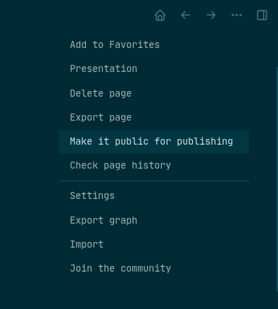
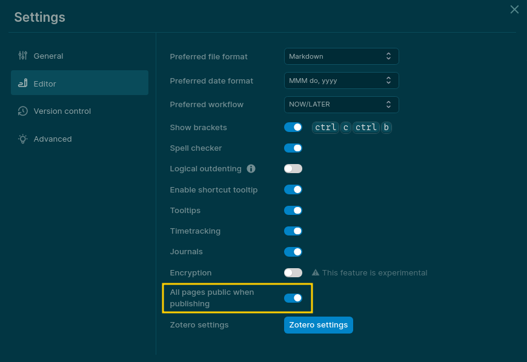
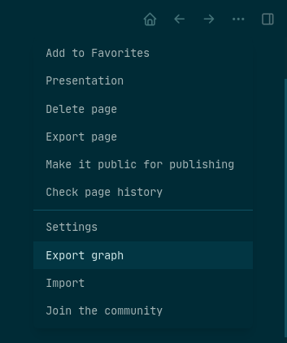

tags:: Publishing

- To provide the best publishing experience, Logseq at this moment only supports publishing on the desktop app.
- How to publish?
	- collapsed:: true
	  1. Click the page titles that you wish to publish, select "Make it public for publishing" in the right pop-up menu.
		- 
		- You can also choose to make all pages public by navigating to [[Settings]] -> Editor and enabling the option "All pages public when publishing"
			- 
	- 2. Click the top-right three-dots and select `Export graph`. Then select a folder, and Logseq will export all the files needed for publishing there.
		- 
	- 3. The exported assets basically make up a web application, when runs Logseq with your public pages, in read-only mode. After exporting, if your are on Linux-like environment, you can cd into the export folder and run `python -m SimpleHTTPServer`. Voila💐, you can now visit the published graph at localhost:8080 in your browser.
	- 4. Of course publishing your beautiful graph on localhost only is not that fun. Since we have all assets now, publish them on platforms like [Github Pages](https://docs.github.com/en/pages/getting-started-with-github-pages/creating-a-github-pages-site) and [Vercel](https://vercel.com/docs) is straight forward. Below is video tutorial on how to publish Logseq pages to Github pages.
		- {{video https://www.youtube.com/watch?v=nf9MyWRratI%7D%7D}}
	- Here're some links might be useful:
		- 1. [Creating a GitHub Pages site](https://docs.github.com/en/github/working-with-github-pages/creating-a-github-pages-site)
		- 2. [Introduction to Vercel](https://vercel.com/docs)