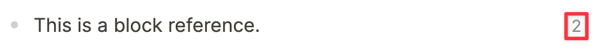
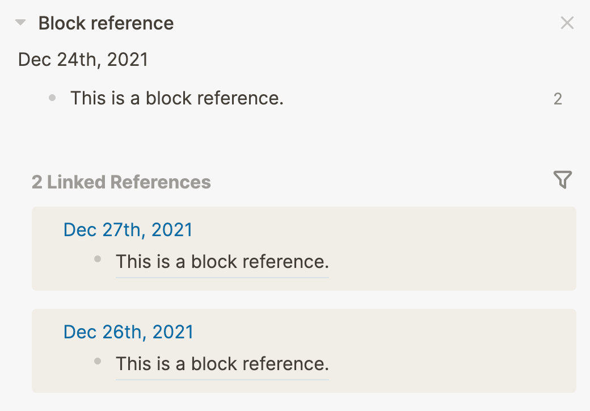
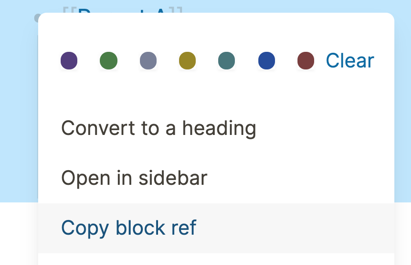
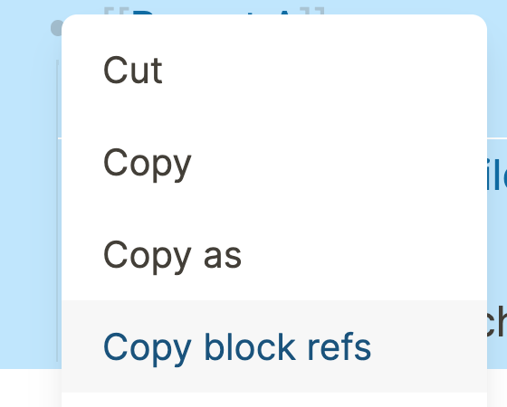
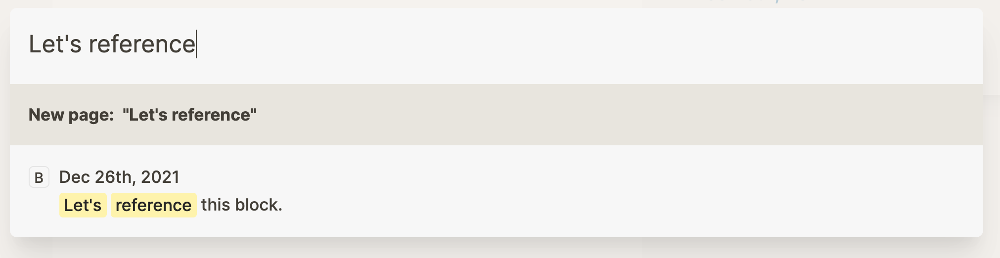
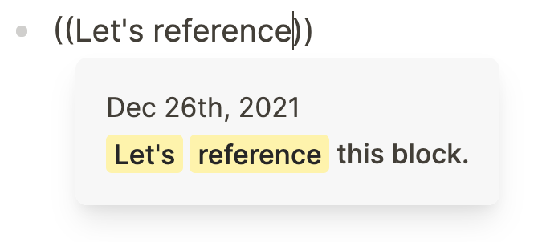

- ## What are block references?
	- Because everything is a block in Logseq, our notes become extremely versatile. Not only we can link to pages, we can also link to blocks and even show their contents directly when linking to them. How? Using block references.
	- Block references are like windows to other parts of your graph. In Logseq, blocks are floating around freely, not bound by any folders. To link together content, every block in Logseq has an address-and this address lets us do lots of cool stuff.
	- Just like we can reference a page by placing it name between [[double brackets]], we can reference a block by using `((double parenthesis))` and placing its address between. The main difference between a page reference (link) and a block reference is that block references show the contents of the block directly. You can recognize a block reference the underline*:
		- 
		  _* Depending on the Logseq theme you're using, block references may show differently._
	- Why would you bother referencing blocks instead of copying over their contents? The reason is simple: to reduce duplicate content. Many people use block references to quickly reuse content from their graph.
	- Whenever you reference a block, the counter to the right of the original block will run up. This number indicates how many times the block has been referenced in the graph.
		- 
	- By clicking on a block reference counter, the block and all of its references will open in the sidebar:
		- 
		- Now that you know the basics of block references, let's see how to create them.
- How to reference blocks
	- There are four ways to reference blocks:
		- Copying their address
		- Clicking-dragging them
		- Searching for them
		  id:: 63d3b42b-df51-41e5-be39-3836f6ef9650
		- In an alias
		  id:: 63d3b431-7f42-45ce-98b6-9d815d472b32
	- Let's have a look at each separately.
	- ### Copy the block ref
		- The easiest way to reference a block is by having it in front of you. Simply `Right-Click` on the bullet of the block you want to reference, and click `Copy block ref` to copy its address (including double parentheses) to your clipboard:
			- 
		- You can also select multiple blocks and copy all of their addresses (again, including double parentheses) to your clipboard:
			- 
			  id:: 63d76f39-b987-437c-8a81-c8ef0f7e3e27
	- ### Click-drag blocks
		- A second way to reference a block when it's in front of you is by clicking and holding the bullet of a block with your mouse. Then, holding `Alt` key (Windows/Linux), you'll see a green icon with `+` sign appears under your cursor. This means you're referencing the block.
			- 
	- ## Search for the block
		- Searching for a block is possible in two ways: using the top search bar or with inline search.
		- #### Using the search bar
			- Whenever you type something in the top search bar (shortcut: `Ctrl+k` on Windows), Logseq will search both for pages and blocks. You can recognize the blocks in the search results by the letter `B` (for **B**lock) in front of it:
				- 
		- #### Using inline search
			- Whenever you type `((` and text, you start searching your entire graph. By typing words that are mentioned in the block you're looking for, you refine your search. Hit `Enter` when you've found the block to pull its address between parentheses. Tada! You've just done the fastest block search possible in Logseq:
				- 
	- ### Link to blocks using an alias
		- Finally, we can use good ol' links to target a specific block. But, instead of using `[[double brackets]]`, we need to use alias/external link (see the article [[Aliases and external links]] for more info) :
			- `[link text](((block-address)))`
		- Between the single `[[brackets]]` you place the label text for the link. Between the `(single parentheses)`, you put the block address (including `((double parentheses))`). Now, by clicking the link you're taken to the block (zoomed in view).