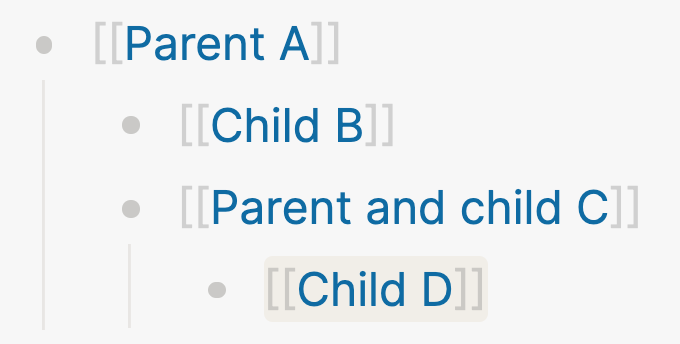

- Indentation is one of the fundamental concept in Logseq (and outliners in general). It is the feature that allows block references and queries to work. In other words: indentation helps you to find stuff in Logseq.
- The idea of indentation is simple: anytime you hit the `Tab` key, the block your cursor is in moves to the right. Indenting a block _nests_ it under the block above, creating a parent-child relationship.
	- 
	- Let's walk through the example step-by-step:
		- Block **A** is a _parent_ block; **B** and **C** are _children_ of **A**; block **D** is a grandchild of **A**.
		- Block **B** is a _child_ of **A** and it is in the same branch as blocks **C** and **D**.
		- Block **C** is a _child_ of **A** and the _parent_ of **D**.
	- Why is this important? As we've discussed in the previous lessons, Logseq is a networked note-taking tool that works with links. We also discussed that Logseq has no hierarchy, which is actually nuanced. As you've probably deduced by now, hierarchy in Logseq happens at the block level.
	- By associating blocks, you create a branch that you can navigate. Let's turn the example above into links and navigate to the linked refences of block **D**, which we'll name _Child **D**_:
		- 
		- By going to the page of _Child **D**_, we can see this hierarchy it's in: first up is _Parent and child **C**_ and then _Parent **A**_.
		- By clicking on one of the parents, the whole branch becomes visible:
			- 
		- That's the basics of indentation! It's not much more complex than this, but it opens up a world of possibilities.