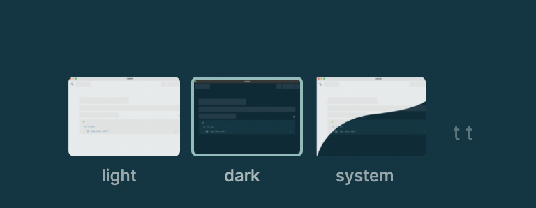

- Logseq comes with 3 default theme modes:
	- `light` mode
	- `dark` mode
	- `system` mode will choose between `light` and `dark` mode based on your operating system's theme mode
- You can toggle between `light` or `dark` mode with command `t t` when not in text editing
- 
	-