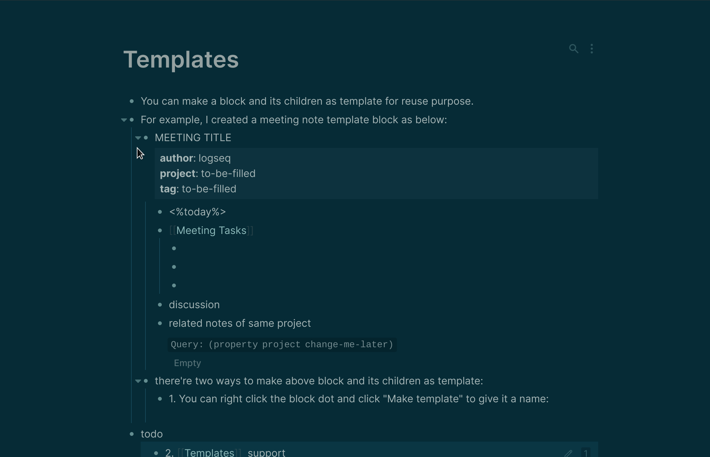
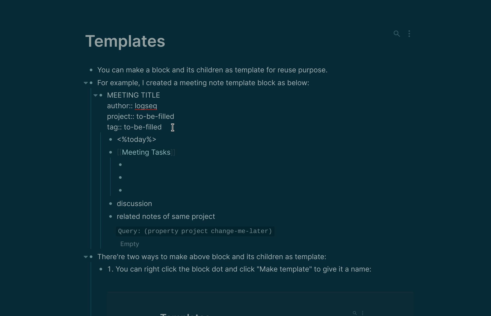
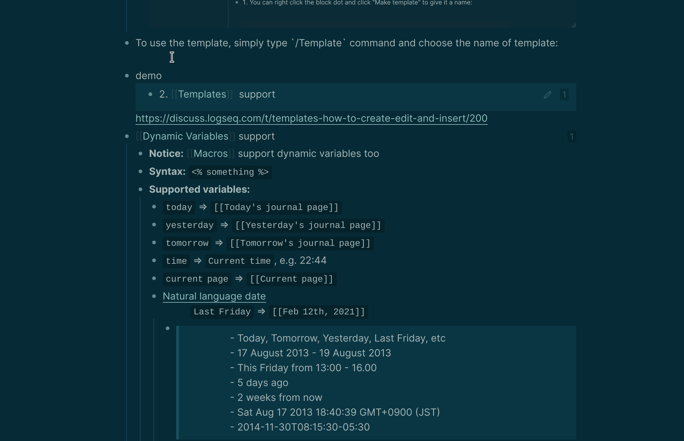

type:: [[Feature]]
platform:: [[All Platforms]] except [[Publish Web]]

- You can make a block and its children as template for reuse purpose.
- For example, let's create a meeting note template block as below for reuse:
	- MEETING TITLE
	  author:: logseq
	  project:: to-be-filled
	  tag:: to-be-filled
	  template:: meeting
		- <%today%>
		- [[Meeting Tasks]]
			-
			-
			-
		- discussion
		- related notes of same project
		  query-table:: false
		  {{query (property project change-me-later)}}
- There're two ways to make above block and its children as template:
	- 1. You can right click the block dot and click "Make template" to give it a name:
	   
	  2. Or you can add [[term/properties]] of `template` with its name directly:
	  
- To use the template, simply type `/Template` command and choose the name of template: 
- other resources to learn how to template:
	- [[Cobbelbot]] contributed this wonderful [tutorial from forum](https://discuss.logseq.com/t/templates-how-to-create-edit-and-insert/200)
	- this great video from [onestutteringmind]([[One Stuttering Mind]]) also shows how to use templates (note the property syntax in this video is no longer used, check [[term/properties]] for latest syntax)
	  {{video https://www.youtube.com/watch?v=l4keRsRFnuc}}
- [[Dynamic Variables]] support
	- **Notice:** [[Macros]] support dynamic variables too
	- **Syntax:** `<% something %>`
	- **Supported variables:**
		- `today` => ` [[Today's journal page]]`
		- `yesterday` => `[[Yesterday's journal page]]`
		- `tomorrow` => `[[Tomorrow's journal page]]`
		- `time` => `Current time, e.g. 22:44`
		- `current page` => `[[Current page]]`
		- [Natural language date](https://github.com/wanasit/chrono)
		  `Last Friday` => `[[Feb 12th, 2021]]`
			- #+BEGIN_QUOTE
			  - Today, Tomorrow, Yesterday, Last Friday, etc
			  - 17 August 2013 - 19 Augugst 2013
			  - This Friday from 13:00 - 16:00
			  - 5 days ago
			  - 2 weeks from now
			  - Sat Aug 17 2013 18:40:39 GMT+0900 (JST)
			  -2014-11-30T08:15:30-05:30
			  #+END_QUOTE
			  Examples from https://github.com/wanasit/chrono
- [:code "template-including-parent:: false"] is a template property to indicate whether to include the top level content of selected block template
	- example
	  id:: 63da36c7-f5aa-4a53-b2b1-1f72e8f6a60e
		- i'm included by default in template-example-1
		  template:: template-example-1
			- line1
				- line2
		- i'm not included because of temple-including-parent setting
		  template:: template-example-2
		  template-including-parent:: false
			- line1
				- line2
- TODO Organize this page #docs